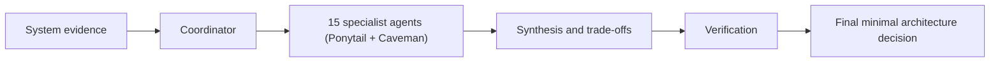

# Quality Attribute Agents (Ponytail + Caveman Integrated)

> [!summary]
> Isang reusable architecture-review team na may 15 specialist sub-agents. Bawat sub-agent ay may integrated **Ponytail** principles (YAGNI, minimal working diffs, stdlib/native priority) at **Caveman** execution format (terse, zero-fluff, dense signal).

## Core Integration Rules

1. **Ponytail Ladder**: Skip speculative work (YAGNI). Use stdlib/native features over third-party dependencies. Mark deliberate trade-offs with `# ponytail:` comments.
2. **Caveman Output**: Zero filler, high density. Format output as `[issue] -> cause -> fix`.

## Agent Notes

1. [[01 - Performance Agent]]
2. [[02 - Scalability Agent]]
3. [[03 - Availability Agent]]
4. [[04 - Reliability and Correctness Agent]]
5. [[05 - Resilience and Recoverability Agent]]
6. [[06 - Security Agent]]
7. [[07 - Privacy and Data Protection Agent]]
8. [[09 - Auditability and Traceability Agent]]
9. [[09 - Observability and Operability Agent]]
10. [[10 - Maintainability and Modifiability Agent]]
11. [[11 - Testability and Evaluability Agent]]
12. [[12 - Interoperability and Compatibility Agent]]
13. [[13 - Usability and Accessibility Agent]]
14. [[14 - Portability and Deployability Agent]]
15. [[15 - Cost Efficiency and Sustainability Agent]]

## Suggested Workflow

Each agent output format:

- Severity + Confidence
- `[issue] -> cause -> fix`
- Ponytail evaluation (YAGNI, stdlib/native option, `# ponytail:` debt tag)
- Measurement evidence
- Acceptance test
