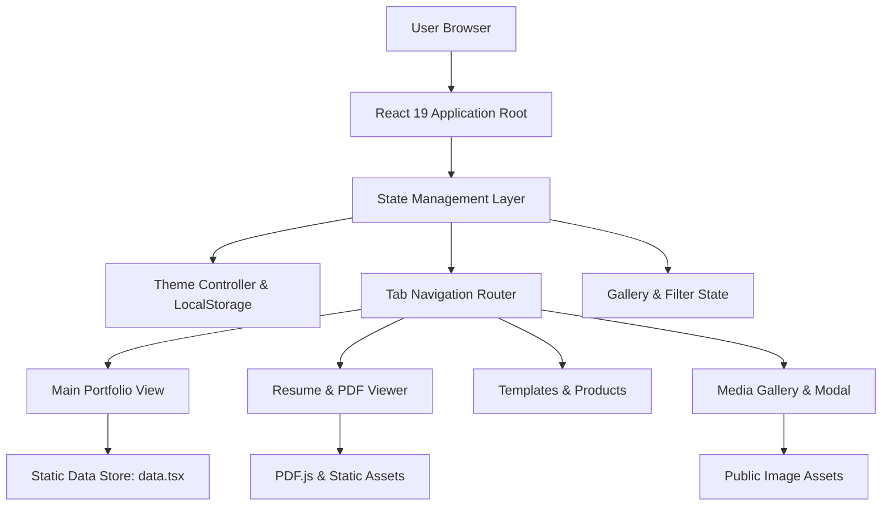

---
tags:
  - technical-documentation
  - web-development
  - react
  - architecture
type: technical-documentation
date: 2026-07-23
---

# System Architecture & Technical Specifications: PortfolioWeb Platform

## High-Level System Architecture & Tech Stack

The PortfolioWeb application is a single-page frontend system built with [[React]] 19, [[TypeScript]], and [[Vite]]. The application renders content dynamically through local structured datasets rather than relying on external runtime backend endpoints.

### Core Tech Stack

- Frontend Framework: [[React]] 19 (React DOM 19)
- Language: [[TypeScript]] 5.9
- Build Tool & Server: [[Vite]] 6
- Styling: [[Tailwind CSS]] v4 with [[PostCSS]]
- Motion & Animation: [[Framer Motion]] 12
- Icons: [[Lucide React]]
- PDF Processing: [[PDF.js]] (`pdfjs-dist`)
- Code Quality & Linting: [[ESLint]] 9 with TypeScript ESLint plugins

---

## Core Data Models & Data Schemas

The system maintains a centralized, read-only data model defined inside `src/data.tsx`. The primary data structure export is the `DATA` object.

### Data Types and Fields

1. Personal Profile (`DATA`)
   - `name`: string
   - `title`: string
   - `location`: string
   - `phone`: string
   - `email`: string
   - `objective`: string

2. Technical & Soft Skills (`DATA.skills`)
   - `technical`: Array of `{ name: string, tag: string, icon: JSX.Element }`
   - `soft`: Array of string

3. Projects (`DATA.projects`)
   - `name`: string
   - `role`: string
   - `desc`: string
   - `icon`: JSX.Element
   - `url`: string
   - `tags`: Array of string

4. Education (`DATA.education`)
   - `school`: string
   - `period`: string
   - `level`: string

5. Achievements (`DATA.achievements`)
   - `title`: string
   - `category`: string
   - `icon`: JSX.Element

6. External Links & Products (`DATA.links`, `DATA.digitalProducts`)
   - `name`: string
   - `desc`: string
   - `url`: string
   - `icon`: JSX.Element
   - `tag`: string (optional)

7. Design Templates (`DATA.designTemplates`)
   - `name`: string
   - `category`: string
   - `desc`: string
   - `preview`: string (relative URL path)
   - `format`: string
   - `canvaUrl`: string
   - `tools`: Array of string

8. Visual Gallery (`DATA.gallery`)
   - `id`: string
   - `title`: string
   - `category`: string ("certs" | "projects")
   - `image`: string (relative asset path)
   - `aspectRatio`: string
   - `details`: object with date, tech, role, and description attributes

---

## Primary Services & Subsystems

### 1. Theme Controller & Persistence
Theme selection (light vs dark mode) is driven by `isDarkMode` state. The controller checks `localStorage` key `theme` upon mount, falling back to the system preference via `window.matchMedia('(prefers-color-scheme: dark)')`. Theme updates modify the `dark` class on `document.documentElement` and write to storage within a `try/catch` block to support restricted client environments.

### 2. Document & PDF Rendering Engine
The platform includes dual resume viewing options. Users can switch between interactive React markup or an embedded [[PDF.js]] view that pulls static files stored in `public/RESUME_LATEST2026.pdf`.

### 3. Media Modal & Keyboard Navigation Service
The gallery view features an interactive image inspection modal. Keyboard events are registered on the global window context to handle modal closure when pressing the `Escape` key.

### 4. Application Splash Loader
An introductory loading sequence uses [[Framer Motion]] `AnimatePresence`. The splash screen blocks content during initial execution before unmounting from the DOM.

---

## Frontend Application Page Breakdown

The application follows a tab-driven single-page architecture controlled by `activeTab` state.

| Route / Tab | Key Components & Sub-views | Functionality |
| :--- | :--- | :--- |
| `main` | Header, Profile Bio, Skill Cards, Project Grid, Achievements | Primary landing experience detailing background, technical capabilities, and featured applications. |
| `resume` | View Mode Switcher, Interactive Layout, PDF Embed | Displays work history, qualifications, and downloadable PDF assets. |
| `stack` | Technology Category Cards, Competency Badges | Categorized overview of development tools, databases, and frameworks. |
| `products` | Resource Cards, Notion Integration Links | Lists guides, playbooks, and external developer tutorials. |
| `templates` | Graphic Grid, Canva Direct Action Buttons | Showcases design assets, flyers, and editorial template previews. |
| `links` | Profile Link List | Directory of external social and code repository profiles. |
| `gallery` | Category Filter Bar, Masonry Grid, Lightbox Modal | Interactive asset inspection view for certificates and project screenshots. |

---

## Security, Data Protection & Permission Controls

### Client-Side Storage Safety
All read and write interactions with `localStorage` are wrapped in `try/catch` exception handlers. This prevents runtime script termination in environments where third-party storage or cookies are blocked by browser privacy policies.

### Component Error Isolation
Sub-components are isolated using [[React]] class-based Error Boundaries (`src/components/ErrorBoundary.tsx`). If a rendering error occurs in a visual component, the boundary catches the exception and renders a fallback UI without failing the entire application tree.

### Keyboard & Accessibility Compliance
Interactive elements enforce basic accessibility standards:
- Skip to main content anchor link (`href="#main"`) for screen readers and keyboard navigation.
- Accessible ARIA labels on non-text button triggers (e.g., theme toggle, mobile menu button).
- Keyboard handler fallbacks (`Enter` and `Space` keys) for non-native button elements.
