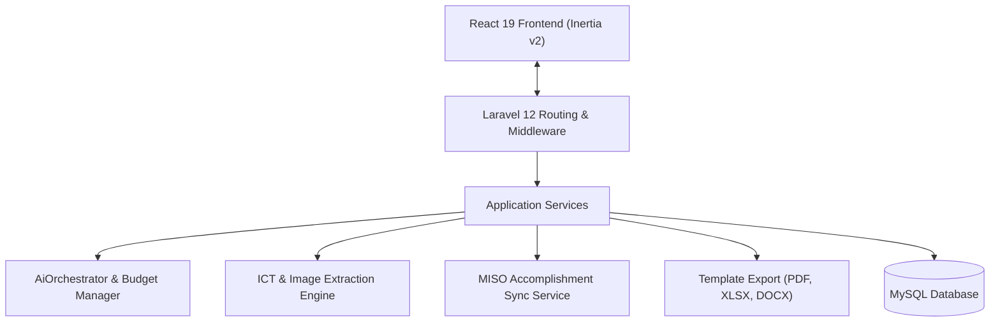

---
tags:
  - project/aira-logix
  - stack/laravel
  - stack/react
type: project-overview
created: 2026-07-23
---
---
tags:
  - project/aira-logix
  - stack/laravel
  - stack/react
  - stack/inertia
type: technical-documentation
created: 2026-07-23
---

# AIRA-LOGIX Detailed Technical Documentation

AIRA-LOGIX is a web application designed for ICT service request tracking, MISO accomplishment reporting, AI-driven document intake, and resource analytics. It employs a modern monolithic architecture: [[Laravel]] 12 handles backend logic and API services, while [[React]] 19 renders the single-page application frontend through [[Inertia.js]] v2.

---

## 1. Core Architecture & Tech Stack

### Backend Layer
- **Framework:** [[Laravel]] 12 on PHP 8.2+.
- **AI Integration:** Powered by `neuron-core/neuron-ai` for managing prompt chains, data extraction pipelines, and model interactions.
- **Document Generation:** 
  - `PhpSpreadsheet` for custom Excel report building.
  - `PhpWord` for formatted DOCX document exports.
  - `Laravel DomPDF` for rendering server-side PDF reports.
- **Logging & Diagnostic:** Laravel Pail for real-time log tailing.

### Frontend Layer
- **SPA Framework:** [[React]] 19 paired with [[Inertia.js]] v2, eliminating API boilerplate while maintaining single-page app responsiveness.
- **Styling & Components:** [[Tailwind CSS]] v4 with [[Radix UI]] primitives and [[Lucide React]] icons.
- **Data Visualization:** [[Recharts]] for dynamic metrics (request volumes, completion speeds, budget graphs) and [[Mermaid.js]] for embedded workflow diagrams.

---

## 2. Key Data Models

### `IctServiceRequest`
Tracks end-to-end ICT service operations.
- **Attributes:** Request number, client details, unit/department, request type, priority level, status, assigned technician, problem description, resolution notes, timestamps.
- **Relations:** Belongs to assigned user, has attachments, linked to `IctSearchIndex`.

### `MisoAccomplishment`
Records Management Information System Office (MISO) activities.
- **Attributes:** Accomplishment title, category, work units, date performed, target system, technical notes, completion metrics.

### `AiUsageLog`
Monitors AI resource consumption to prevent API budget overruns.
- **Attributes:** Service name, prompt token count, completion token count, estimated cost, response latency, caller identifier, timestamp.

### `IctSearchIndex`
Stores indexed tokens and keywords across requests and accomplishments to enable fast full-text querying without high database overhead.

---

## 3. Key Services & Subsystems

### AI Orchestration & Budget Management (`AiOrchestrator`, `AiBudgetManager`)
Handles calls to external AI models through `neuron-core/neuron-ai`.
- Enforces strict monthly or per-request token spending caps via `AiBudgetManager`.
- Intercepts requests when budget limits are met, logging every call in `AiUsageLog` for transparency on API costs.

### Smart Intake & Extraction (`IctExtractionService`, `IctImageExtractionService`)
Processes uploaded scanned documents, tickets, or image attachments.
- Uses optical character recognition and field parsing to automatically extract request types, client information, and issue summaries.
- Pre-fills forms in `miso-smart-scan.tsx` and `smart-scan.tsx` to reduce manual entry errors.

### Accomplishment Synchronization (`MisoAccomplishmentSyncService`)
Handles batch updates and legacy data imports for MISO records.
- Cleans and normalizes incoming logs into standard `MisoAccomplishment` database entries.
- Reconciles duplicated entries and updates relevant search indices.

### Multi-Format Export Engine (`IctTemplateService`, `MisoTemplateService`)
Generates standardized agency documents based on filtered database queries.
- **Excel (.xlsx):** Outputs audit-ready sheets using pre-styled cell blocks.
- **Word (.docx):** Populates official letterheads and formatted table structures.
- **PDF (.pdf):** Renders vector layouts for printing or formal digital archiving.

---

## 4. Frontend Application Structure

The client interface is structured around key functional pages inside `resources/js/Pages/`:

- `dashboard.tsx`: Main overview panel containing real-time request counters, priority breakdowns, and Recharts metrics.
- `smart-scan.tsx` & `miso-smart-scan.tsx`: Document upload dropzones with real-time extraction previews.
- `reports.tsx`: Export workbench where users apply date range, status, and category filters before triggering document downloads.
- `ai-consumption.tsx`: Administrative view showing token usage trends, latency spikes, and accumulated API costs.
- `miso-intake.tsx` & `intake.tsx`: Manual input forms for single service tickets or accomplishment entries.

---

## 5. Security & Data Protection

- **State & CSRF Security:** Native CSRF token handling through Laravel and Inertia session protection.
- **Sanitization:** Strict request payload validation in FormRequests before hitting controllers or extraction services.
- **Role Control:** Access limits separating standard intake users from superadmin capabilities (such as inspecting AI usage logs or adjusting system thresholds).
