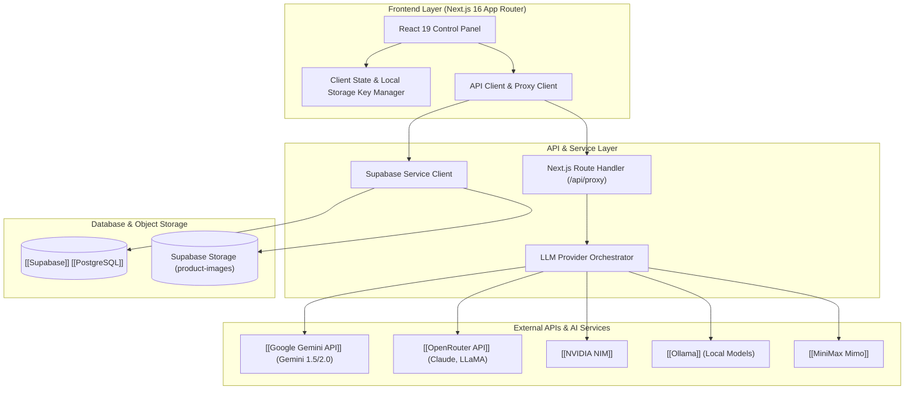

# Content Automation Platform: Technical Architecture & System Specification

## High-Level System Architecture & Tech Stack

The Content Automation platform is a web application designed to turn product ideas, nursery rhymes, educational topics, and video concepts into fully structured storyboards, image prompts, and video prompts targeted at downstream generation engines like [[Google Veo]] and voice cloning services like [[ElevenLabs]].



### Core Technologies

- **Frontend Framework:** [[Next.js]] 16 (App Router) paired with [[React]] 19 and [[TypeScript]] 5.
- **Styling & UI:** [[Tailwind CSS]] v4, [[Radix UI]] primitives (Dialog, Tabs, Slot), [[Framer Motion]] for micro-interactions, and [[Lucide React]] icons.
- **Database & Storage:** [[Supabase]] with underlying [[PostgreSQL]] engine and Supabase Storage for binary assets.
- **AI Integrations:** Native SDK and REST clients for [[Google Gemini API]], [[OpenRouter API]], [[NVIDIA NIM]], [[MiniMax Mimo]], and local [[Ollama]] endpoints.
- **Testing Suite:** [[Vitest]] with [[Testing Library]] and JSDOM integration.

---

## Core Data Models & Database Schemas

The database schema defined in `supabase_schema.sql` handles project metadata, storyboard outputs, and raw image assets.

### 1. Projects Table (`public.projects`)

Stores top-level entity configuration, product attributes, and generated research data.

| Column | Type | Constraints | Description |
| :--- | :--- | :--- | :--- |
| `id` | `TEXT` | `PRIMARY KEY` | Unique project identifier (client-generated or UUID string). |
| `user_id` | `UUID` | `NULLABLE` | Optional foreign key referencing `auth.users`. |
| `product_name` | `TEXT` | `NOT NULL` | Name of the target product or topic. |
| `product_category` | `TEXT` | `NOT NULL` | Category classification. |
| `product_features` | `TEXT` | `NOT NULL` | Formatted feature summary or raw product description. |
| `primary_image_url` | `TEXT` | `NULLABLE` | Public URL of uploaded primary product image. |
| `reference_images` | `TEXT[]` | `DEFAULT '{}'` | Array of public URLs for supplemental visual context. |
| `research_data` | `JSONB` | `NULLABLE` | Serialized JSON containing extracted pain points, benefits, and target audience profiles. |
| `config_data` | `JSONB` | `NULLABLE` | Generation parameters (provider selection, model string, tone, scene count, POV). |
| `created_at` | `TIMESTAMPTZ` | `DEFAULT utc now()` | Record creation timestamp. |

### 2. Storyboards Table (`public.storyboards`)

Contains ordered scene sequences generated for each project.

| Column | Type | Constraints | Description |
| :--- | :--- | :--- | :--- |
| `id` | `UUID` | `PRIMARY KEY, DEFAULT gen_random_uuid()` | Unique record identifier. |
| `project_id` | `TEXT` | `FOREIGN KEY (public.projects.id) ON DELETE CASCADE` | Parent project linkage. |
| `scene_number` | `INT` | `NOT NULL` | Sequential position within the video outline. |
| `duration` | `INT` | `NOT NULL` | Scene runtime in seconds. |
| `emotion` | `TEXT` | `NOT NULL` | Visual and vocal emotional tone cue. |
| `voiceover` | `TEXT` | `NOT NULL` | Character script (Tagalog, English, or Taglish). |
| `text_on_screen` | `TEXT` | `NOT NULL` | On-screen graphics and text overlay instructions. |
| `image_prompt` | `TEXT` | `NOT NULL` | Frame image prompt tailored for [[Google Veo]]. |
| `video_prompt` | `TEXT` | `NOT NULL` | Animation/camera directive tailored for [[Google Veo]]. |
| `image_url` | `TEXT` | `NULLABLE` | Generated frame image preview URL or base64 data. |
| `audit_data` | `JSONB` | `NULLABLE` | Generation audit trail tracking provider, model, execution status, and fallback logs. |
| `created_at` | `TIMESTAMPTZ` | `DEFAULT utc now()` | Record creation timestamp. |

### 3. Object Storage Buckets

- **Bucket Name:** `product-images` (Public access enabled).
- **Purpose:** Stores user-uploaded product photos and reference images used during multi-modal LLM analysis and visual reference workflows.

---

## Primary Services & Subsystems

### 1. Multi-Provider LLM Orchestrator (`src/lib/api.ts`)

The API service coordinates calls across LLM providers with built-in fallback fallback chains and structured output parsing.

- **Provider Resolution:** Resolves provider preferences in order: [[Google Gemini API]], [[OpenRouter API]], [[NVIDIA NIM]], [[MiniMax Mimo]], [[Ollama]], or fallback Mock provider.
- **Structured JSON Extraction:** Enforces JSON responses using system instructions or regex-based extraction functions to guarantee schema conformity for storyboard objects.
- **Audit Logging:** Every generation step constructs an `AiGenerationAudit` payload recording provider name, model identifier, key name context, timestamp, and fallback retry logs.

### 2. Specialized Content Generators

- **Product Commercial Generator:** Transforms product metadata and web research into multi-scene commercial scripts, hook variations, image prompts, and video motion instructions.
- **Nursery Rhyme Generator:** Produces structured children's content including stanza breakdowns, rhyming voiceover lines, educational elements, and 2D/3D cartoon visual prompts.
- **Educational Explainer Generator:** Turns complex topics into step-by-step visual lessons with key takeaway callouts and visual diagrams.
- **Thumbnail & Short Video Generator:** Generates high-CTR thumbnail prompts and short-form video hooks tailored for platforms like TikTok and YouTube Shorts.

### 3. Server API Proxy (`src/app/api/proxy/route.ts`)

A dedicated [[Next.js]] Route Handler proxies client requests to external LLM endpoints when cross-origin limitations or API key protection require server-side routing.

### 4. Health Diagnostic & Log Subsystem (`src/app/health/page.tsx`, `src/app/logs/page.tsx`)

- **Health Monitor:** Executes active connectivity checks against Supabase, active AI keys, local API routes, and storage buckets.
- **System Logs:** Provides visual inspection of recent generation runs, audit payloads, quality warnings, and error tracebacks.

---

## Frontend Application Page Breakdown

The application follows a single-page workspace layout (`src/app/page.tsx`) supplemented by diagnostic sub-routes.

```
src/app/
├── page.tsx           # Primary Control Panel Workspace
├── health/page.tsx    # System Health & Connectivity Dashboard
├── logs/page.tsx      # System Activity & Execution Log Viewer
└── api/proxy/route.ts # Server-side API Proxy Handler
```

### 1. Primary Control Panel (`src/app/page.tsx`)

The main interface is divided into functional control steps:

- **Mode Selection Bar:** Switches workspace context between Commercial Product, Nursery Rhyme, Educational Explainer, and Thumbnail/Short Video workflows.
- **Input Components (`StepInput`, `StepNurseryRhymeInput`, etc.):** Handles user text entry, image drops via `react-dropzone`, preset selection, and parameter adjustments.
- **Configuration Step (`StepConfig`):** Configures model provider, model variant, script tone, scene count, POV, target language, and brand kit active persona.
- **Research View (`StepResearch`):** Displays extracted audience insights, pain points, core benefits, and character personalities.
- **Storyboard Output (`StepStoryboard`, `StepNurseryRhymeOutput`, etc.):** Displays rendered scene cards with one-click copy buttons for Character Voiceover, Image Prompts, and Motion Video Prompts. Includes inline scene editing and hook variant scoring.
- **Brand Kit Drawer (`BrandKitManager`):** Manages reusable visual style kits, custom prompts, and character persona libraries.
- **Settings Modal (`SettingsDialog`):** Securely manages local API keys (Gemini, OpenRouter, NVIDIA) in browser storage.

### 2. Health Monitoring Page (`src/app/health/page.tsx`)

Displays status indicators for backend connectivity, database readiness, storage bucket accessibility, and API response latencies.

### 3. Execution Logs Page (`src/app/logs/page.tsx`)

Provides direct log viewing for API calls, prompt debugging, payload audits, and error diagnostic traces.

---

## Security, Data Protection & Permission Controls

### 1. Row Level Security ([[Row Level Security|RLS]])

Supabase tables enforce mandatory Row Level Security policies:

- **Projects Table Policies:** `Allow public select`, `insert`, `update`, and `delete` on `public.projects` for both anonymous and authenticated roles.
- **Storyboards Table Policies:** `Allow public select`, `insert`, `update`, and `delete` on `public.storyboards` with `ON DELETE CASCADE` foreign key enforcement.
- **Storage Policies:** `Allow public upload`, `read`, `update`, and `delete` on `storage.objects` restricted specifically to the `product-images` bucket.

### 2. Client-Side Secret Management

API keys for external AI providers ([[Google Gemini API]], [[OpenRouter API]], [[NVIDIA NIM]]) are held in browser `localStorage` or session state and injected directly into request headers. Keys are never hardcoded or persisted on server disks.

### 3. Input Validation & Proxy Safety

The `/api/proxy` endpoint verifies target URL structures, inspects request headers, and prevents SSRF attacks by restricting proxy targets to approved AI provider endpoints.
