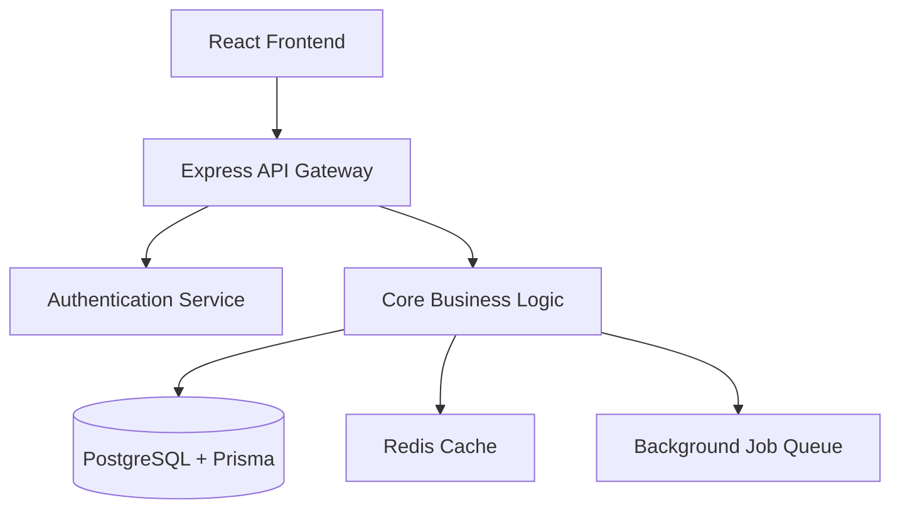

---
tags:
  - tech-stack
  - architecture
  - project-matrix
  - react
  - nodejs
  - typescript
  - obsidian-knowledge
type: tech-stack-guide
date: 2026-07-23
---

# 🛠️ Tech Stack & Architecture Matrix Across Projects

> [!NOTE]
> Reference breakdown of the tech stacks, frameworks, databases, and tooling used across your web development projects.

---

## 1. Single Page Applications (SPAs) & Frontend Systems

Used in client-facing web applications, portfolios, and static resource hubs (e.g., **PortfolioWeb**).

### Core Stack
- **Framework:** [[React]] 19
- **Language:** [[TypeScript]] 5.9
- **Build Tool:** [[Vite]] 6
- **Styling:** [[Tailwind CSS]] v4 with [[PostCSS]]
- **Animations:** [[Framer Motion]] 12
- **Iconography:** [[Lucide React]]
- **Document Viewing:** [[PDF.js]] (`pdfjs-dist`)
- **Linting:** [[ESLint]] 9 with TypeScript rules

### Architectural Focus
- Zero-backend client architecture reading from typed local data contracts (`src/data.tsx`).
- Instant tab switching state instead of client-side router packages.
- Pure client-side PDF rendering and interactive gallery lightboxes.

---

## 2. Full-Stack Web Applications & Modular Monoliths

Used in complex data-driven platforms (e.g., **Church Management System** and administrative web apps).

### Core Stack
- **Backend Runtime:** [[Node.js]] with [[TypeScript]]
- **API Layer:** [[Express.js]] (RESTful API Gateway)
- **Frontend Layer:** [[React]] with [[Tailwind CSS]]
- **Database:** [[PostgreSQL]]
- **ORM:** [[Prisma]]
- **Data Fetching & Cache:** [[TanStack Query]] (React Query)
- **Caching & Job Queue:** [[Redis]] & Background Workers

### Architectural Focus
- Modular monolith pattern separating Auth, Core Logic, and Background Jobs.
- Type safety from database schema (Prisma) to API routes and React query hooks.
- Asynchronous job processing for background tasks and data exports.

---

## 3. Development Tools & Ecosystem Summary

| Layer | Primary Choice | Alternative / Context |
| :--- | :--- | :--- |
| **Language** | [[TypeScript]] | Standard across all frontend and backend projects |
| **Frontend UI** | [[React]] 19 | Paired with [[Tailwind CSS]] |
| **Backend Runtime** | [[Node.js]] | Express REST APIs |
| **Database** | [[PostgreSQL]] | Managed via [[Prisma]] ORM |
| **State & Fetching** | Client `useState` (SPAs) | [[TanStack Query]] (Full-Stack Apps) |
| **Design Integration** | [[Canva]] templates | Embedded previews & link triggers |
| **Build & Dev Server** | [[Vite]] | Fast HMR and build bundling |

---

## 4. Stack Selection Strategy

- **For Static / High-Performance Frontends:** React + Vite + TypeScript + Tailwind CSS. Fast load times, low bundle overhead, zero database maintenance.
- **For Relational Data Apps:** Node.js + Express + PostgreSQL + Prisma + TanStack Query. Strong data integrity, structured schemas, scalable API routes.
