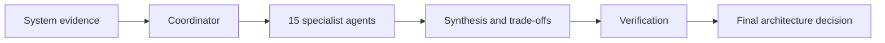

# Quality Attribute Agents

> [!summary]
> Isang reusable architecture-review team na may isang specialist sub-agent para sa bawat quality attribute. Ang main agent ang nagko-coordinate, nagre-resolve ng trade-offs, at gumagawa ng final decision.

## Agent notes

1. [[01 - Performance Agent]]
2. [[02 - Scalability Agent]]
3. [[03 - Availability Agent]]
4. [[04 - Reliability and Correctness Agent]]
5. [[05 - Resilience and Recoverability Agent]]
6. [[06 - Security Agent]]
7. [[07 - Privacy and Data Protection Agent]]
8. [[08 - Auditability and Traceability Agent]]
9. [[09 - Observability and Operability Agent]]
10. [[10 - Maintainability and Modifiability Agent]]
11. [[11 - Testability and Evaluability Agent]]
12. [[12 - Interoperability and Compatibility Agent]]
13. [[13 - Usability and Accessibility Agent]]
14. [[14 - Portability and Deployability Agent]]
15. [[15 - Cost Efficiency and Sustainability Agent]]

## Coordination and review toolkit

16. [[16 - Quality Review Coordinator]]
17. [[17 - Standard Finding Template]]
18. [[18 - Agent Selection Matrix]]
19. [[19 - System Evidence Checklist]]
20. [[20 - Quality Scorecard Template]]
21. [[21 - Auditability vs Observability]]
22. [[22 - Architecture Decision Record Template]]
23. [[23 - Acceptance Test Template]]
24. [[24 - 30-60-90 Day Roadmap Template]]
25. [[25 - Agent Limits and Budgets]]

## Suggested workflow

Each agent should return:

- Severity and confidence
- Affected component or workflow
- Evidence and missing evidence
- Requirement or SLO at risk
- Recommendation
- Acceptance test
- Trade-offs with other attributes

## Recommended starting sequence

1. Use [[18 - Agent Selection Matrix]] to choose the relevant specialists.
2. Prepare [[19 - System Evidence Checklist]].
3. Run the review through [[16 - Quality Review Coordinator]].
4. Require [[17 - Standard Finding Template]] from every agent.
5. Record the result in [[20 - Quality Scorecard Template]].
6. Document trade-offs with [[22 - Architecture Decision Record Template]].
7. Verify recommendations with [[23 - Acceptance Test Template]].
8. Schedule improvements in [[24 - 30-60-90 Day Roadmap Template]].
9. Enforce [[25 - Agent Limits and Budgets]].
